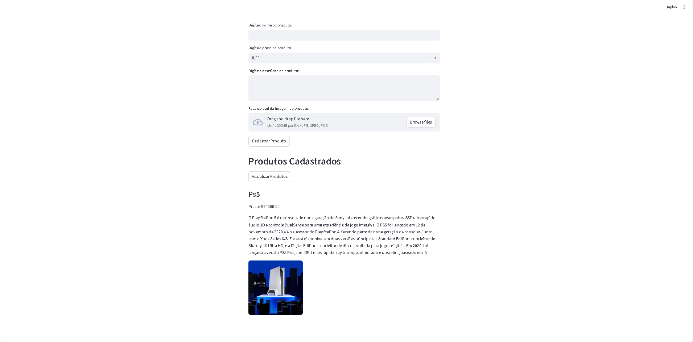

# E-CommerceCloud

Aplicacao simples de cadastro e visualizacao de produtos para um e-commerce, usando Streamlit no frontend, SQL Server para persistencia e Azure Blob Storage para armazenar imagens.

**Recursos**
- Cadastro de produto com nome, preco, descricao e imagem.
- Upload de imagem para Azure Blob Storage.
- Persistencia dos dados no SQL Server.
- Listagem de produtos cadastrados.

**Captura de tela**


**Tecnologias**
- Python + Streamlit
- Azure Blob Storage (SDK `azure-storage-blob`)
- SQL Server (driver `pymssql`)
- `python-dotenv` para carregar variaveis de ambiente

**Requisitos**
- Python 3.9+ recomendado
- Acesso a um SQL Server
- Conta de Azure Storage com um container Blob

**Instalacao**
```bash
python -m venv venv
./venv/Scripts/activate
pip install -r requirements.txt
```

**Configuracao (.env)**
Crie um arquivo `.env` na raiz com as variaveis abaixo:
```env
BLOB_ACCOUNT_NAME=seu_blob_account
BLOB_CONTAINER_NAME=seu_container
# Pode ser a connection string completa OU somente a account key
BLOB_CONNECTION_STRING=sua_connection_string_ou_account_key

SQL_SERVER=seu_servidor
SQL_DATABASE=seu_banco
SQL_USER=seu_usuario
SQL_PASSWORD=sua_senha
```

**Banco de dados**
Crie a tabela no SQL Server:
```sql
CREATE TABLE Produtos (
    id INT IDENTITY(1,1) PRIMARY KEY,
    nome NVARCHAR(255),
    descricao NVARCHAR(MAX),
    preco DECIMAL(18,2),
    imagem_url NVARCHAR(2083)
);
```

**Como executar**
```bash
streamlit run main.py
```

**Uso**
- Preencha os campos e faca upload da imagem.
- Clique em `Cadastrar Produto`.
- Clique em `Visualizar Produtos` para listar os cadastrados.

**Observacoes**
- Nao versionar o arquivo `.env`.
- Se a conexao com o Blob Storage falhar, confira o container e as credenciais.
